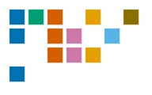

<div align="center">



# RAG World

**A self-updating registry of retrieval-augmented generation technologies.**
Every record carries a configuration over a stratified schema, a maturity level
derived by a deterministic rule from collected evidence, and the evidence itself.

[](https://ragworld.org)
[](https://ragworld.org/data/index.json)

[](https://github.com/laputski/rag-world/actions/workflows/ci.yml)
[](https://github.com/laputski/rag-world/actions/workflows/collect.yml)
[](https://github.com/laputski/rag-world/actions/workflows/mutation.yml)
[](LICENSE)
[](data/LICENSE.md)

[Foundations](https://ragworld.org/article) ·
[Registry](https://ragworld.org/registry) ·
[Changelog](https://ragworld.org/changes) ·
[Contributing](CONTRIBUTING.md)

</div>

---

## What this is

Over fifty named RAG architectures have been published, and comparing them is
hard: descriptions give a vocabulary of components but no common coordinates.
Ask whether one system is more mature than another and you get opinions.

RAG World answers both questions with data you can check.

**Every technology is a point in a configuration space.** Twenty-eight
dimensions across seven strata, with `requires` and `excludes` constraints
between values. Two systems can therefore be compared coordinate by coordinate,
and an inadmissible combination is caught by the schema rather than by review.

**Every maturity level is derived, not assigned.** A deterministic rule reads
the collected evidence — publications, peer review, repository state, framework
presence, package downloads, documented industrial use — and returns a level
from L0 to L6. No language model takes part. The same evidence always yields the
same level, so any value reproduces on a rerun.

**Every claim is traceable.** A level shows the rule output and the evidence
under it. A configuration value shows why it was read that way, from which
source. A number without provenance is not published; the field stays empty and
the interface says so.

**What the schema cannot express is recorded too.** Each record carries a
*residual*: the mechanisms the twenty-eight dimensions do not capture. A
mechanism seen in three or more records becomes a candidate for a new dimension.
Two dimensions have entered the schema this way.

## Data

The portal renders these files and nothing else. Reading them directly is
supported and preferred over scraping the pages.

| File | What it holds |
|---|---|
| [`data/index.json`](https://ragworld.org/data/index.json) | index of every dataset: purpose, record count, schema version |
| [`data/registry.json`](https://ragworld.org/data/registry.json) | every record with configuration, level, evidence and prose |
| [`data/tech/{id}.json`](https://ragworld.org/data/tech/pathrag.json) | one record on its own, for when the whole registry is not wanted |
| [`data/changes.json`](https://ragworld.org/data/changes.json) | append-only chronicle of level changes with their evidence |
| [`data/residuals.json`](https://ragworld.org/data/residuals.json) | mechanisms the schema does not express |
| [`data/candidates.json`](https://ragworld.org/data/candidates.json) | works found by discovery, awaiting a human verdict |

Also published: [`llms.txt`](https://ragworld.org/llms.txt) for language models,
[`sitemap.xml`](https://ragworld.org/sitemap.xml), and RSS in
[English](https://ragworld.org/data/feed.xml) and
[Russian](https://ragworld.org/data/feed.ru.xml).

Text fields carry both languages: `summary` beside `summary_en`. A Russian
string without an English twin fails the build.

```bash
curl -s https://ragworld.org/data/index.json | jq '.datasets[] | {url, records}'
curl -s https://ragworld.org/data/tech/pathrag.json | jq '.technology.level'
```

## How it stays current

Collection runs weekly from arXiv, OpenAlex, GitHub, PyPI, Papers with Code and
curated topic lists. The run collects evidence, recomputes levels, rebuilds the
artefacts and validates everything before anything is committed.

Changes are classified before they land. A routine change is committed by the
bot; a level crossing L3–L4, a demotion, or evidence entered by a human goes to
a pull request instead. When the classifier cannot decide, it asks for review
rather than guessing — the gate fails closed.

The portal never contacts those sources while serving. A source going down ages
the data; it does not break the site.

## Repository layout

```
data/                the registry: one JSON file per technology, plus
                     append-only evidence, metrics and level journals
core/                dimension schema, configuration validation, maturity rule
services/collectors/ evidence collectors, one per source
scripts/             entry points: collect, recompute, build, validate
ui/                  the static portal (React, TypeScript)
ui/public/data/      built artefacts, the only thing the portal reads
governance/          decision log, including decisions later reversed
specs/               stage specifications, each marked with its state
docs/                data layout (DATA.md) and the list of sources polled
research/archive/    planning documents from before the rebuild, kept as history
```

Dependencies point one way: views depend on artefacts, artefacts on the
registry, the registry on evidence, evidence on collectors.

## Running it

```bash
make install-dev     # virtualenv and development dependencies
make test            # Python tests
make dev             # portal on http://localhost:5174
make build           # static build into ui/dist
```

One command updates everything, and it is the same command the scheduled run
uses:

```bash
make collect
```

Individual steps are available as `levels`, `artifacts`, `validate`, `icons`.

Environment variables are optional and passed by the shell; no dotenv file is
read. `OPENALEX_MAILTO` gets a politer request pool from the open index;
`GITHUB_TOKEN` raises the rate limit and is supplied to the scheduled run
automatically.

## Testing

Coverage says a line ran. It does not say anyone would notice if it broke.

Alongside the usual tests, this repository keeps a curated mutation catalogue:
each rule the project rests on is broken on purpose, one edit at a time, and the
suite must notice. A mutant that survives marks a rule nothing guards. A mutant
that fails to apply counts as a failure too, not as a skip — a pattern that no
longer matches is a check that quietly stopped checking.

```bash
make mutate                          # the whole catalogue
python3 scripts/mutate.py --only links
```

## Citing

Cite a release rather than the live files: the live files change every week.

Releases are dated, immutable snapshots listed in
[`data/releases/index.json`](https://ragworld.org/data/releases/index.json).
Citation formats for a release and for a single record are on the
[About page](https://ragworld.org/about).

## Licences

Code is Apache-2.0 ([LICENSE](LICENSE)). The registry data and the artefacts
built from it are CC BY 4.0 ([data/LICENSE.md](data/LICENSE.md)) — attribute as
*RAG World, https://ragworld.org*.

## Contributing

Corrections and new records are welcome; see [CONTRIBUTING.md](CONTRIBUTING.md).
The short version: a record needs a resolvable source, and every value that
differs from the base configuration needs a reason with a citation.

Much of the in-code commentary is still in Russian and is being translated
progressively. New code is written in English.
